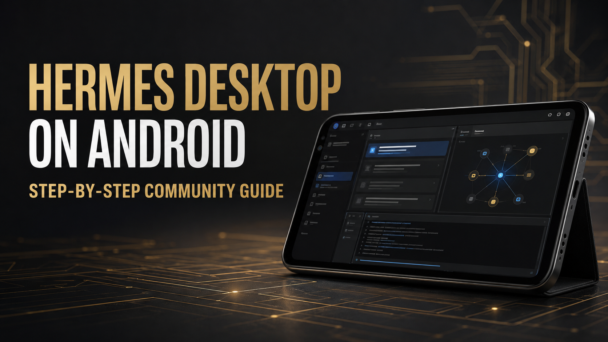

# Hermes Desktop on Android



Reproducible setup notes and launch tooling for running the Linux Hermes
Desktop application on an Android phone through Termux and Termux:X11.

> [!IMPORTANT]
> This is a community experiment, not an official Nous Research Android port.
> Hermes officially documents the CLI on Termux; the Desktop application is
> officially supported on macOS, Windows, and Linux. This project documents a
> working Android setup and the extra compatibility steps it needs.

## What this project will contain

- Exact prerequisites and tested device information
- Repeatable installation commands
- An Android-friendly Hermes Desktop launcher
- Termux:X11 touch, scaling, and window-management settings
- Visible local-browser setup
- A read-only diagnostics script
- Troubleshooting for the failures encountered during the original setup

See [Troubleshooting](docs/TROUBLESHOOTING.md) for the compatibility fixes and
[Stack details](docs/STACK.md) for the architecture.

## Architecture

Android does not execute the Linux Electron build directly as a native Android
application. The working stack has four layers:

1. **Android** provides the device and app sandbox.
2. **Termux** provides the terminal and Unix userland.
3. **Termux:X11** renders Linux windows on the Android display.
4. **Hermes Desktop** runs its normal Electron UI and talks to the normal
   Hermes backend.

This gets the real Hermes Desktop interface onto the phone. It does **not**
turn the Electron app into an APK or automatically grant it Android system
permissions.

## Diagnostics

Run:

```bash
bash scripts/doctor.sh
```

The report contains versions and paths needed to reproduce a setup. It does
not read Hermes API keys, model credentials, or chat contents.

## Status

The repository is being assembled from a working Galaxy S25 setup. Installer
and launcher scripts will be published after the exact runtime versions are
captured and checked against current Hermes upstream.

## Upstream projects

- [NousResearch/hermes-agent](https://github.com/NousResearch/hermes-agent)
- [termux/termux-app](https://github.com/termux/termux-app)
- [termux/termux-x11](https://github.com/termux/termux-x11)

The source links used to validate this guide are collected in
[docs/SOURCES.md](docs/SOURCES.md).

## License

MIT. Hermes Agent and Termux:X11 retain their own licenses and trademarks.
