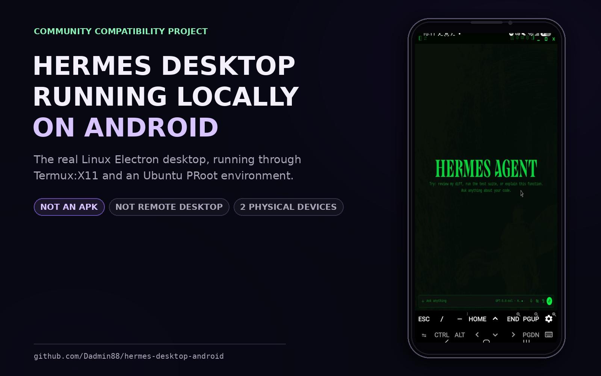
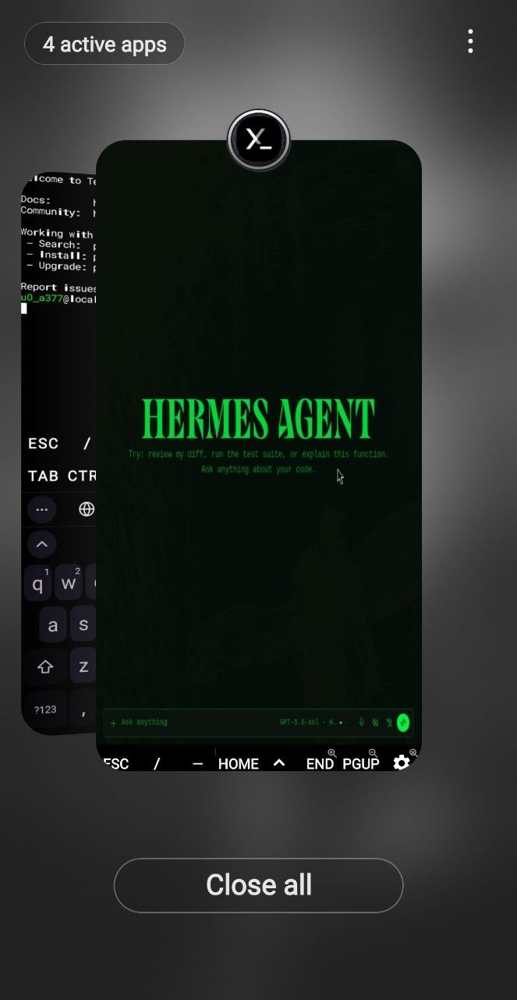

# Hermes Desktop on Android

[](https://github.com/Dadmin88/hermes-desktop-android/actions/workflows/shell-checks.yml)
[](https://github.com/Dadmin88/hermes-desktop-android/releases/latest)

<p align="center">
  
</p>

Run the real Linux Hermes Desktop Electron application locally on Android through
Termux, Termux:X11, and an Ubuntu PRoot guest. The verified path renders Hermes
directly into X11 with the standalone `xfwm4` window manager—without starting a
full Xfce desktop session.

**[Install v0.1.2](#install)** · **[Report your device](https://github.com/Dadmin88/hermes-desktop-android/issues/new?template=device-report.yml)** · **[Read the architecture](docs/STACK.md)**

> [!IMPORTANT]
> This is a community compatibility project, not an official Nous Research
> Android port, native APK, or remote-desktop setup. Hermes officially supports
> its CLI on Termux. This repository documents a compatibility layer for running
> the separate Desktop application on Android and currently claims only the two
> manually verified physical devices listed below.

## Authentic Android proof

<p align="center">
  
</p>

Android's own Recents interface shows the Termux terminal environment beside the
separate Termux:X11 session containing Hermes Desktop. This is the original
physical-device capture—not a generated device mockup. The presentation card
above uses a separate authentic Hermes-on-phone capture.

## What you get

- The real Hermes Desktop interface—not a recreated web page
- A touch-usable Hermes window rendered directly by Termux:X11
- Working move, maximize, resize, and window-switching controls from `xfwm4`
- Hermes Agent and Electron running in an aarch64 Ubuntu environment
- `hermes-android` to launch Desktop and `hermes-ubuntu` to enter Ubuntu
- Versioned diagnostics and troubleshooting
- Optional control of the same phone through an explicitly paired Wireless ADB
  bridge

This is **not** an APK. Desktop and Android control are separate layers:
Termux:X11 displays Hermes, while the optional Wireless ADB bridge grants
explicitly authorized device access. See [Architecture](docs/STACK.md).

## Tested stack

Manually verified on two physical Android devices:

| Device | Android | Linux guest | Node.js / npm | Result |
|---|---|---|---|---|
| Samsung Galaxy S25 | 16 / API 36 | Ubuntu 24.04.4 LTS | 22.23.1 / 10.9.8 | Desktop GUI verified |
| Samsung Galaxy Tab S6 Lite (`SM-P620`) | 16 / API 36 | Ubuntu 26.04 LTS | 22.23.2 / 10.9.8 | Fresh install and Desktop GUI verified |

Both installations use Termux:X11 on `:1`, standalone `xfwm4`, Hermes Agent
v0.19.1 at upstream revision `c2ff2e8b`, managed Python 3.11.15, and the
source-built workspace Electron application under `/usr/local/lib/hermes-agent`.
The tablet verification exposed missing Electron runtime packages in `v0.1.0`;
`v0.1.1` installs `libnspr4`, `libnss3`, and `libgl1` automatically.

The source checkout had only npm-generated `package-lock.json` churn. No
Android-specific Hermes source patch was required.

## Before you start

Install both Android apps:

1. **Termux** from a current official Termux distribution channel.
2. **Termux:X11** from its official
   [nightly release](https://github.com/termux/termux-x11/releases/tag/nightly).
   Install `termux-x11-universal-debug.apk`.

Termux:X11 requires both the Android APK and its companion Termux package. The
installer below handles the companion package.

If you choose the `sharedUid` Termux:X11 APK to reduce Android background
slowdowns, follow the upstream signing requirements exactly: it only works with
a compatible GitHub-built Termux APK. Do not mix APK sources.

## Install

Open the **Termux host shell**—not an Ubuntu prompt—and run:

```bash
release=v0.1.2
curl -fSLO "https://github.com/Dadmin88/hermes-desktop-android/releases/download/$release/install-termux.sh"
curl -fSLO "https://github.com/Dadmin88/hermes-desktop-android/releases/download/$release/install-termux.sh.sha256"
sha256sum --check install-termux.sh.sha256
bash install-termux.sh
rm -f install-termux.sh install-termux.sh.sha256
```

The checksum must report `install-termux.sh: OK` before the installer runs.
The release installer pins all nested project-script downloads to the exact
release commit SHA; it does not assemble an installation from mutable branch or
tag contents.

The installer deliberately has two stages:

1. Termux installs `x11-repo`, `termux-x11-nightly`, `proot-distro`,
   `pulseaudio`, the standalone `xfwm4` window manager, and the host launcher.
   The full Xfce desktop is not required.
2. Ubuntu installs Linux build dependencies, pins the known-working Hermes
   commit, installs Hermes, builds Desktop in source mode, and installs the
   guest launchers.

The first build downloads and compiles a substantial JavaScript/Electron
workspace. Keep Termux in the foreground and prevent Android from suspending it.

If Ubuntu already contains a different Hermes checkout, the installer stops
instead of force-replacing it. Back up deliberate local changes before opting
into any commit replacement.

### Existing working Hermes installation

To install only the launch wrappers without changing packages, the Hermes
checkout, or the Desktop build, run from Termux:

```bash
release=v0.1.2
curl -fSLO "https://github.com/Dadmin88/hermes-desktop-android/releases/download/$release/install-launchers.sh"
curl -fSLO "https://github.com/Dadmin88/hermes-desktop-android/releases/download/$release/install-launchers.sh.sha256"
sha256sum --check install-launchers.sh.sha256
bash install-launchers.sh
rm -f install-launchers.sh install-launchers.sh.sha256
```

Then test the packaged launch flow with `hermes-android`. The same installer
also adds `hermes-ubuntu` for opening the Ubuntu guest from Termux.

## Enter Ubuntu

From the Termux host prompt, run:

```bash
hermes-ubuntu
```

This is the memorable equivalent of
`proot-distro login ubuntu --shared-tmp`. Type `exit` to return to Termux.

## Configure a model

After installation, configure Hermes from the Termux shell:

```bash
proot-distro login ubuntu --shared-tmp -- hermes model
```

Or run the full setup:

```bash
proot-distro login ubuntu --shared-tmp -- hermes setup
```

Hermes stores its own credentials and configuration. This repository does not
read, copy, or publish them.

Before upgrades, reinstalls, or removal, read
[Maintenance, upgrades, and removal](docs/MAINTENANCE.md). It identifies the
Hermes user-data boundary and includes backup-first procedures.

## Launch

From Termux:

```bash
hermes-android
```

That command:

1. Starts the Termux PulseAudio server.
2. Starts Termux:X11 on display `:1` at 120 DPI.
3. Opens the Termux:X11 Android activity.
4. Starts `xfwm4` by itself so Linux windows can move, maximize, resize, and
   switch without launching the full Xfce desktop.
5. Enters Ubuntu with `proot-distro --shared-tmp`.
6. Launches Hermes from its source build with workspace Electron.

The launcher defaults can be overridden when a device needs them:

```bash
HERMES_X11_DPI=144 hermes-android
HERMES_X11_EXTRA_ARGS=-legacy-drawing hermes-android
HERMES_X11_EXTRA_ARGS="-legacy-drawing -force-bgra" hermes-android
```

## Make touch usable

Inside the Termux:X11 app:

- Use **touchpad mode** for desktop-style pointer control.
- Tap for left click; two-finger tap for right click.
- Two-finger swipe scrolls.
- In simulated touchscreen mode, long-press and move to drag.
- Press Android **Back** to toggle the on-screen keyboard.
- In direct mode, restore Termux:X11 from Android Recents if you switch away.
- `xfwm4` provides maximize, resize, and `Alt+Tab` without an Xfce panel.
- Landscape orientation gives Hermes substantially more usable room.

## Direct mode and browser windows

The launcher sets:

```bash
AGENT_BROWSER_HEADED=1
AGENT_BROWSER_ARGS=--no-sandbox,--disable-dev-shm-usage
```

Hermes browser tools can open a headed Linux browser on the same X11 display.
The included standalone `xfwm4` process manages Hermes and browser windows. A
native Android browser opened through ADB is different: it appears as a normal
Android app and can be restored from Android Recents.

## Optional: let Hermes operate the same Android phone

In the tested setup, the phone was paired back to itself through Android's
Wireless ADB feature. That allowed Hermes to inspect the Android UI, send
Home/Back/tap/swipe commands, and launch native Android apps while Hermes
Desktop kept running in Termux:X11.

This is powerful access and is **not enabled by the desktop installer**. Only
pair devices you own and trust, keep Wireless debugging off when you do not need
it, and never expose an ADB endpoint to an untrusted network.

Follow the exact [Wireless ADB bridge guide](docs/WIRELESS-ADB.md). The short
version, run inside Ubuntu, is:

```bash
apt-get update && apt-get install -y adb
adb pair PHONE_IP:PAIRING_PORT
adb connect PHONE_IP:CONNECTION_PORT
adb devices
```

The pairing and connection ports are normally different. Android shows both in
**Developer options → Wireless debugging**.

## Why source mode?

The verified phone has:

- `apps/desktop/dist/index.html`
- workspace Electron under `node_modules/electron/dist/electron`
- no packaged app under `apps/desktop/release`

That is expected. The project builds Hermes Desktop with:

```bash
hermes desktop --source --build-only --force-build \
  --hermes-root /usr/local/lib/hermes-agent
```

and launches the resulting renderer directly through workspace Electron. This
avoids the extra electron-builder packaging layer that is unnecessary on the
phone.

Because the Ubuntu PRoot guest runs as root, Chromium/Electron is launched with
`--no-sandbox`. That is a compatibility tradeoff, not a security improvement.
Only run trusted code and trusted Electron content in this environment.

## Diagnostics

The doctor is layer-aware. Run it once from Termux:

```bash
release=v0.1.2
curl -fSLO "https://github.com/Dadmin88/hermes-desktop-android/releases/download/$release/doctor.sh"
curl -fSLO "https://github.com/Dadmin88/hermes-desktop-android/releases/download/$release/doctor.sh.sha256"
sha256sum --check doctor.sh.sha256
bash doctor.sh
```

Then run it inside Ubuntu:

```bash
doctor=$(mktemp "$PREFIX/tmp/hermes-doctor.XXXXXX")
cp doctor.sh "$doctor"
proot-distro login ubuntu --shared-tmp -- \
  bash "/tmp/$(basename "$doctor")"
rm -f "$doctor" doctor.sh doctor.sh.sha256
```

The report intentionally omits API keys, `.env` files, auth data, sessions,
chat history, and message contents.

## Manual inspection

Every mutating installer supports a dry run:

```bash
bash install-termux.sh --dry-run
```

Download and verify `install-termux.sh` with the release checksum first, using
the commands in [Install](#install).

Read [Troubleshooting](docs/TROUBLESHOOTING.md) for black screens, incorrect
colors, scaling, hidden windows, browser issues, and build failures.

## Project status

The direct-X11 workflow has been manually verified on two physical Android
devices, including a fresh installation on the Galaxy Tab S6 Lite. The
automation is regression-tested in this repository, but broad Android-device
compatibility remains unverified. If you reproduce it on another device, open a
[device compatibility report](https://github.com/Dadmin88/hermes-desktop-android/issues/new?template=device-report.yml)
with both layer-aware doctor reports and your device model.

## Releases

The current project release is `v0.1.2`. Installers default to that project tag
and separately pin the known-working Hermes upstream revision. See the
[changelog](CHANGELOG.md) and [release page](https://github.com/Dadmin88/hermes-desktop-android/releases/latest).

## Development checks

```bash
bash tests/run.sh
```

## Upstream projects

- [NousResearch/hermes-agent](https://github.com/NousResearch/hermes-agent)
- [termux/termux-app](https://github.com/termux/termux-app)
- [termux/termux-x11](https://github.com/termux/termux-x11)
- [termux/proot-distro](https://github.com/termux/proot-distro)

Primary references are collected in [Sources](docs/SOURCES.md).

## License

MIT. Hermes Agent, Termux, Termux:X11, Xfce, Electron, and their trademarks
remain subject to their own licenses and policies.
