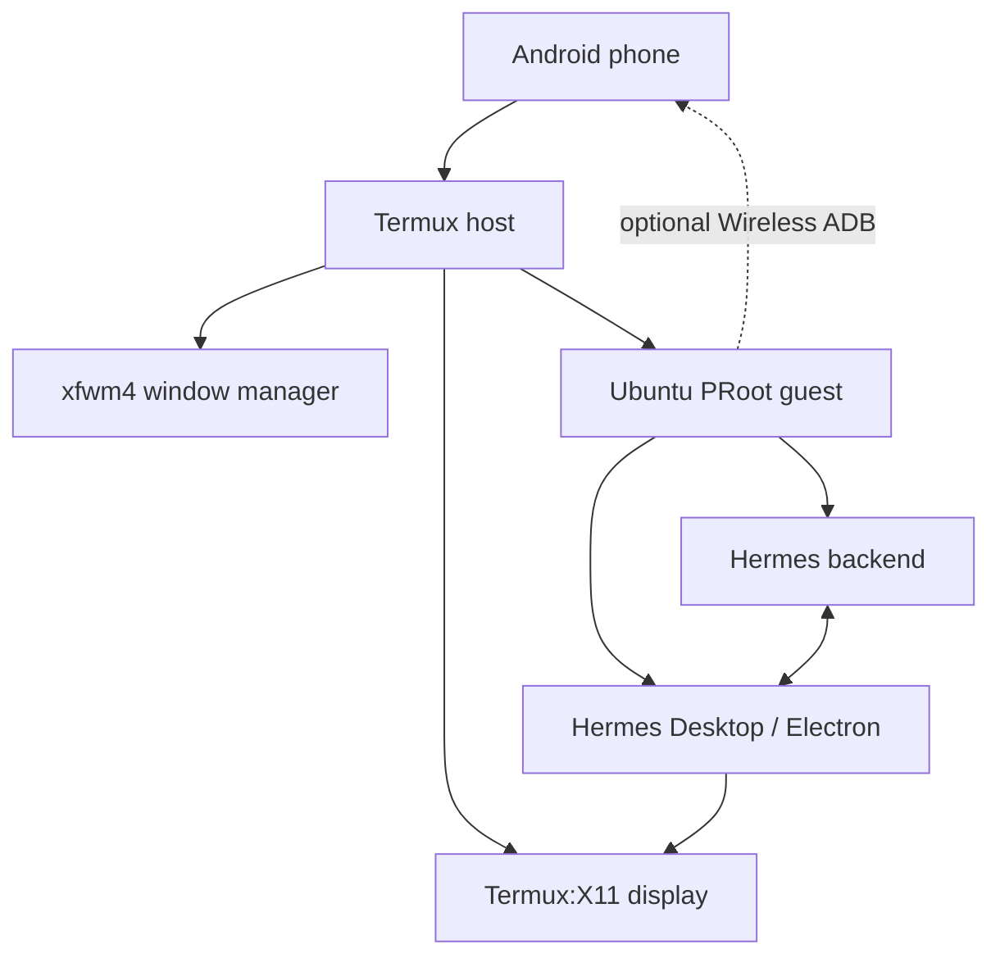

# How the Android stack works

Hermes Desktop is an Electron application. Android does not run that Linux
binary as a native APK, so the working setup supplies each desktop assumption
at a separate layer.

## Layer ownership

| Layer | Owns |
|---|---|
| Android | App lifecycle, touch input, hardware, Android permissions |
| Termux | X11 server companion, standalone `xfwm4`, PulseAudio, PRoot launcher |
| Ubuntu PRoot | glibc Linux environment, Hermes, Node, Electron dependencies |
| Hermes Desktop | Electron renderer, local backend, projects, sessions, tools |

The tested path launches the small `xfwm4` component directly, without an Xfce
desktop session. It belongs in Termux beside the X server; Ubuntu contributes
the app, not the display server or desktop shell.

## Source-mode Desktop

`hermes desktop --source --build-only` creates the renderer and Electron main
bundle under `apps/desktop/dist`. The launcher then calls the workspace Electron
binary directly with the Hermes desktop directory as its app target.

This is why a correct working report can show:

- a source build present;
- a workspace Electron runtime present; and
- a packaged `apps/desktop/release` build absent.

## Consequences

- The interface is the real Hermes Desktop UI.
- Hermes data and configuration stay in the Ubuntu Hermes installation.
- Linux browser windows use the same X11 display and are managed alongside
  Hermes by the standalone `xfwm4` process.
- Android sees Termux:X11 as the visible Android app; individual Linux windows
  do not appear as separate Android recent-app cards.
- Android still isolates Termux from other Android apps and privileged system
  APIs. Device control requires the separate, explicitly paired Wireless ADB
  bridge documented in [Wireless ADB](WIRELESS-ADB.md).

## Security boundary

The Ubuntu PRoot guest runs as root for convenience, while Android still
sandboxes Termux as an unprivileged Android application. Electron and the local
browser require `--no-sandbox` in that guest. Losing Chromium's own sandbox is a
real reduction in defense-in-depth even though Android and Termux boundaries
remain. Run only trusted code and browse with appropriate caution.
