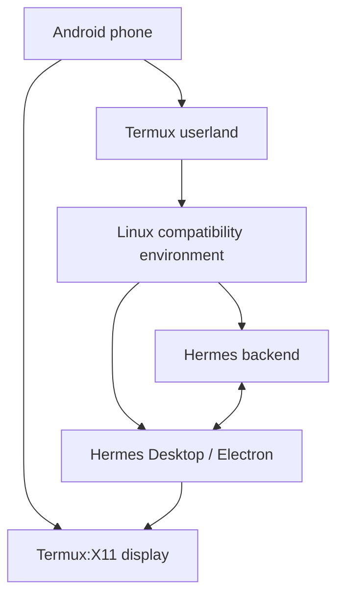

# How the Android stack works

Hermes Desktop is an Electron application. Electron officially targets desktop
operating systems, while Android applications use a different runtime,
graphics stack, package format, permission model, and C library.

The working setup does not translate Hermes Desktop into an APK. It supplies
the desktop assumptions that Electron expects:

## Consequences

- The interface is the real Hermes Desktop UI.
- Hermes data, sessions, skills, and config remain those of the local Hermes
  installation used by the Electron backend.
- Linux browser windows can be displayed beside Hermes through Termux:X11.
- Android still isolates Termux from other Android apps and privileged system
  APIs. Separate Android bridges are required for device control.

